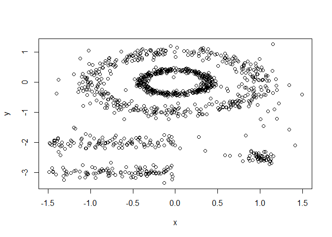
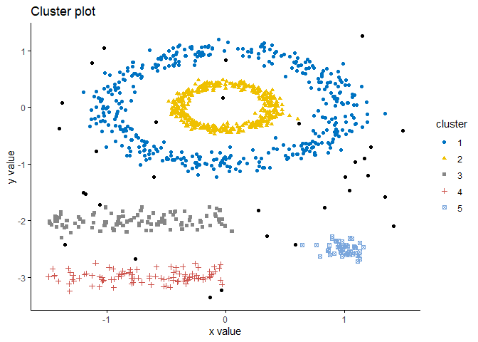
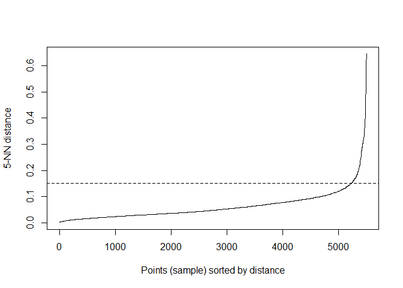

DBSCAN Practice
================
Nidhin
08/08/2019

\#DBSCAN (Density-Based Spatial Clustering and Application with Noise)

\#Here, we’ll use the R package fpc to compute DBSCAN. It’s also
possible to use the package dbscan, which provides a faster
re-implementation of DBSCAN algorithm compared to the fpc package.

``` r
library(fpc)
library(dbscan)
```

    ## 
    ## Attaching package: 'dbscan'

    ## The following object is masked from 'package:fpc':
    ## 
    ##     dbscan

``` r
library(factoextra)
```

    ## Loading required package: ggplot2

    ## Welcome! Related Books: `Practical Guide To Cluster Analysis in R` at https://goo.gl/13EFCZ

``` r
data("multishapes", package = "factoextra")
df <- multishapes[, 1:2]
head(df)
```

    ##            x          y
    ## 1 -0.8037393 -0.8530526
    ## 2  0.8528507  0.3676184
    ## 3  0.9271795 -0.2749024
    ## 4 -0.7526261 -0.5115652
    ## 5  0.7068462  0.8106792
    ## 6  1.0346985  0.3946550

``` r
plot(df)
```

<!-- -->

``` r
set.seed(123)
db <- dbscan(df, eps = .15, MinPts = 5)
```

    ## Warning in dbscan(df, eps = 0.15, MinPts = 5): converting argument MinPts
    ## (fpc) to minPts (dbscan)!

``` r
print(db)
```

    ## DBSCAN clustering for 1100 objects.
    ## Parameters: eps = 0.15, minPts = 5
    ## The clustering contains 5 cluster(s) and 31 noise points.
    ## 
    ##   0   1   2   3   4   5 
    ##  31 410 405 104  99  51 
    ## 
    ## Available fields: cluster, eps, minPts

``` r
# Plot DBSCAN results
fviz_cluster(db, data = df, stand = FALSE,
ellipse = FALSE, show.clust.cent = FALSE,
geom = "point",palette = "jco", ggtheme = theme_classic())
```

<!-- -->

\#One limitation of DBSCAN is that it is sensitive to the choice of eps,
in particular if clusters have different densities. If eps is too small,
sparser clusters will be defined as noise. If eps is too large, denser
clusters may be merged together.

\#Method for determining the optimal eps value

\#The idea is to calculate, the average of the distances of every point
to its k nearest neighbors. The value of k will be specified by the user
and corresponds to MinPts. Next, these k-distances are plotted in an
ascending order. The aim is to determine the “knee”, which corresponds
to the optimal eps parameter. A knee corresponds to a threshold where a
sharp change occurs along the k-distance curve.

``` r
#Method for determining the optimal eps value
dbscan::kNNdistplot(df, k = 5)
abline(h = 0.15, lty = 2)
```

<!-- -->
