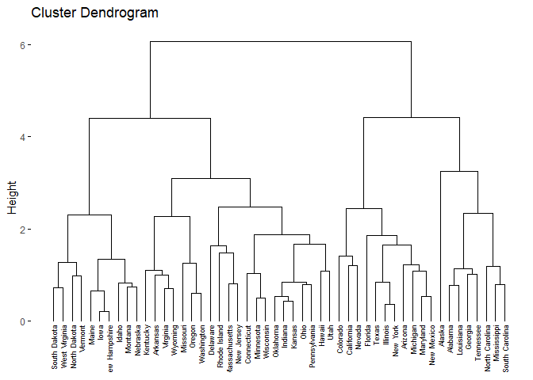
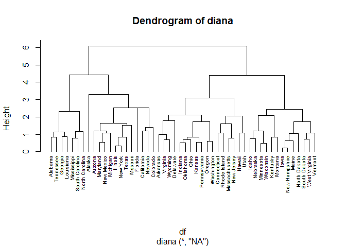
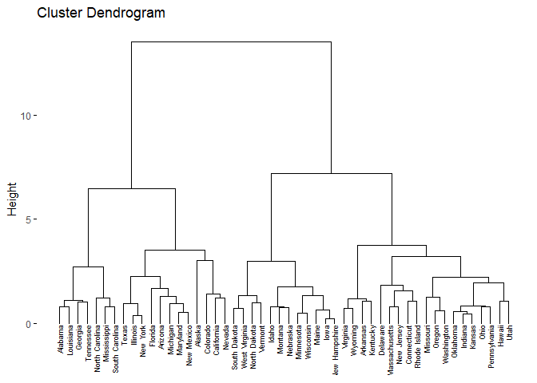
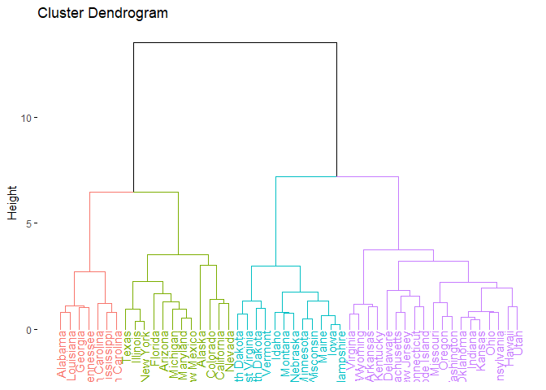
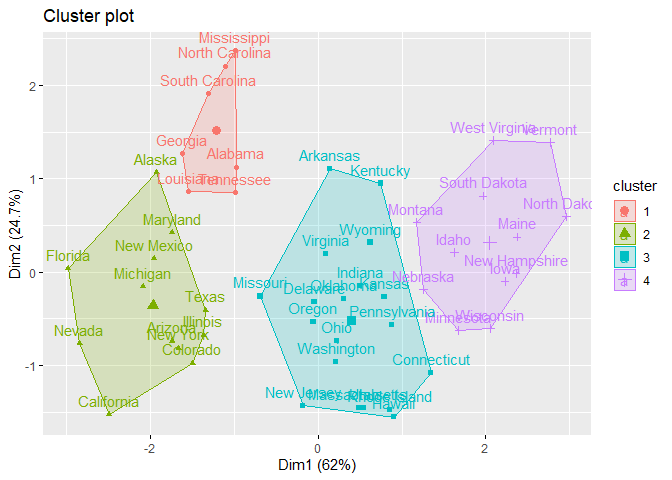
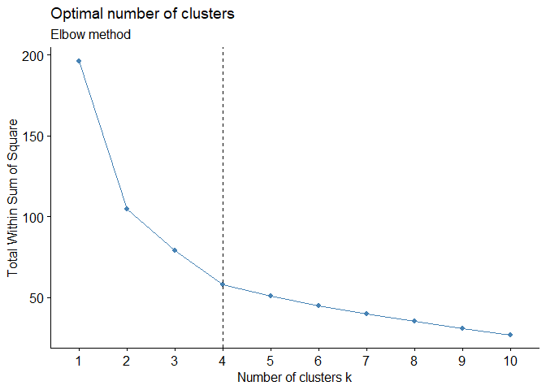
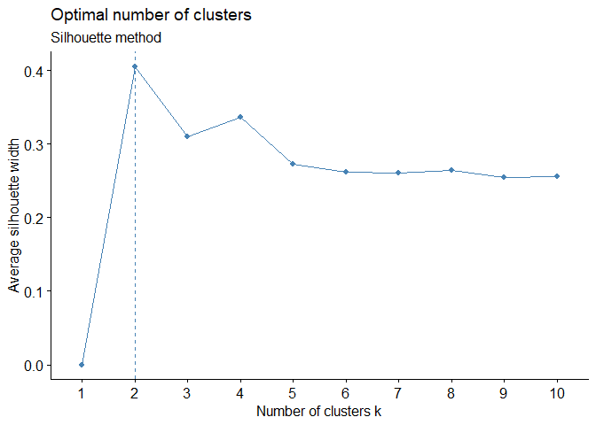
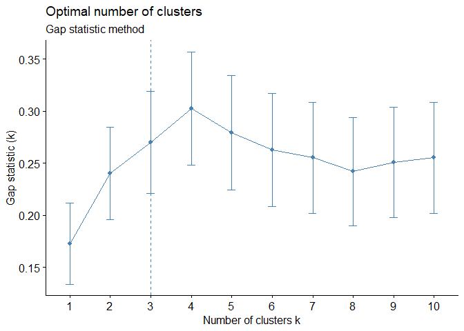

Hierarchical Clustering
================
Nidhin
05/08/2019

\#Here, we’ll use the built-in R data set USArrests, which contains
statistics in arrests per 100,000 residents for assault, murder, and
rape in each of the 50 US states in 1973. It includes also the percent
of the population living in urban areas \#\#Data Preparation \#Rows are
observations (individuals) and columns are variables \#Any missing value
in the data must be removed or estimated. \#The data must be
standardized (i.e., scaled) to make variables comparable. Recall that,
standardization consists of transforming the variables such that they
have mean zero and standard deviation one.\[^scale\]

``` r
#Required Libraries
library(cluster)
library(factoextra)
```

    ## Loading required package: ggplot2

    ## Welcome! Related Books: `Practical Guide To Cluster Analysis in R` at https://goo.gl/13EFCZ

``` r
library(purrr)
library(dplyr)
```

    ## 
    ## Attaching package: 'dplyr'

    ## The following objects are masked from 'package:stats':
    ## 
    ##     filter, lag

    ## The following objects are masked from 'package:base':
    ## 
    ##     intersect, setdiff, setequal, union

``` r
df <- USArrests
df <- na.omit(df)
df <- scale(df)
head(df)
```

    ##                Murder   Assault   UrbanPop         Rape
    ## Alabama    1.24256408 0.7828393 -0.5209066 -0.003416473
    ## Alaska     0.50786248 1.1068225 -1.2117642  2.484202941
    ## Arizona    0.07163341 1.4788032  0.9989801  1.042878388
    ## Arkansas   0.23234938 0.2308680 -1.0735927 -0.184916602
    ## California 0.27826823 1.2628144  1.7589234  2.067820292
    ## Colorado   0.02571456 0.3988593  0.8608085  1.864967207

\#There are different functions available in R for computing
hierarchical clustering. The commonly used functions are \#hclust \[in
stats package\] and agnes \[in cluster package\] for agglomerative
hierarchical clustering (HC)

\#First we compute the dissimilarity values with dist and then feed
these values into hclust Then \#specify the agglomeration method to be
used (i.e. “complete”, “average”, “single”, “ward.D”). \#We can then
plot the dendrogram.

``` r
# Dissimilarity matrix
d <- dist(df, method = "euclidean")
#converting the distance matrix into a matrix for better understanding
as.matrix(d)[1:6, 1:6]
```

    ##             Alabama   Alaska  Arizona Arkansas California Colorado
    ## Alabama    0.000000 2.703754 2.293520 1.289810   3.263110 2.651067
    ## Alaska     2.703754 0.000000 2.700643 2.826039   3.012541 2.326519
    ## Arizona    2.293520 2.700643 0.000000 2.717758   1.310484 1.365031
    ## Arkansas   1.289810 2.826039 2.717758 0.000000   3.763641 2.831051
    ## California 3.263110 3.012541 1.310484 3.763641   0.000000 1.287619
    ## Colorado   2.651067 2.326519 1.365031 2.831051   1.287619 0.000000

``` r
# Hierarchical clustering using Complete Linkage
hc1 <- hclust(d, method = "complete" )

# Compute with agnes
hc2 <- agnes(df, method = "complete")


# Agglomerative coefficient
hc2$ac
```

    ## [1] 0.8531583

``` r
# Plot the obtained dendrogram

library("factoextra")
fviz_dend(hc1, cex = 0.5)
```

<!-- -->
\#Function to check the best clustering structure out of 5 methods.

``` r
# methods to assess
m <- c( "average", "single", "complete", "ward")
names(m) <- c( "average", "single", "complete", "ward")

# function to compute coefficient
ac1 <- function(x) {
  agnes(df, method = x)$ac
}

map_dbl(m, ac1)
```

    ##   average    single  complete      ward 
    ## 0.7379371 0.6276128 0.8531583 0.9346210

\#Divisive Hierarchical Clustering \#The R function diana provided by
the cluster package allows us to perform divisive hierarchical
clustering. diana works similar to agnes; however, there is no method to
provide.

``` r
# compute divisive hierarchical clustering
hc4 <- diana(df)

# Divise coefficient; amount of clustering structure found
hc4$dc
```

    ## [1] 0.8514345

``` r
# plot dendrogram
pltree(hc4, cex = 0.6, hang = -1, main = "Dendrogram of diana")
```

<!-- -->

\#Working with Dendrograms \#In the dendrogram displayed above, each
leaf corresponds to one observation. As we move up the tree,
observations that are similar to each other are combined into branches,
which are themselves fused at a higher height. \#The height of the
fusion, provided on the vertical axis, indicates the (dis)similarity
between two observations. The higher the height of the fusion, the less
similar the observations are.

\#The height of the cut to the dendrogram controls the number of
clusters obtained. It plays the same role as the k in k-means
clustering. In order to identify sub-groups (i.e. clusters), we can cut
the dendrogram with cutree:

``` r
# Ward's method
hc5 <- hclust(d, method = "ward.D2" )
fviz_dend(hc5,cex=0.5)
```

<!-- -->

``` r
# Cut tree into 4 groups
sub_grp <- cutree(hc5, k = 4)
# Number of members in each cluster
table(sub_grp)
```

    ## sub_grp
    ##  1  2  3  4 
    ##  7 12 19 12

\#We can also use the cutree output to add the the cluster each
observation belongs to to our original data.

``` r
USArrests %>%
  mutate(cluster = sub_grp) %>%
  head
```

    ##   Murder Assault UrbanPop Rape cluster
    ## 1   13.2     236       58 21.2       1
    ## 2   10.0     263       48 44.5       2
    ## 3    8.1     294       80 31.0       2
    ## 4    8.8     190       50 19.5       3
    ## 5    9.0     276       91 40.6       2
    ## 6    7.9     204       78 38.7       2

``` r
fviz_dend(hc5,k=4,border = 2:5)
```

<!-- -->

``` r
fviz_cluster(list(data = df, cluster = sub_grp))
```

<!-- -->
\#Determining Optimal Clusters \#Elbow Method \#To perform the elbow
method we just need to change the second argument in fviz\_nbclust to
FUN =
hcut.

``` r
fviz_nbclust(df, FUN = hcut, method = "wss")+geom_vline(xintercept = 4, linetype = 2)+
labs(subtitle = "Elbow method")
```

<!-- -->
\#Average Silhouette Method \#To perform the average silhouette method
we follow a similar process.

``` r
fviz_nbclust(df, FUN = hcut, method = "silhouette")+
labs(subtitle = "Silhouette method")
```

<!-- -->

Gap Statistic Method And the process is quite similar to perform the gap
statistic method.

``` r
# nboot = 50 to keep the function speedy.
# recommended value: nboot= 500 for your analysis.
# Use verbose = FALSE to hide computing progression.

fviz_nbclust(df, hcut, nstart = 25, method = "gap_stat", nboot = 50)+
labs(subtitle = "Gap statistic method")
```

<!-- -->
