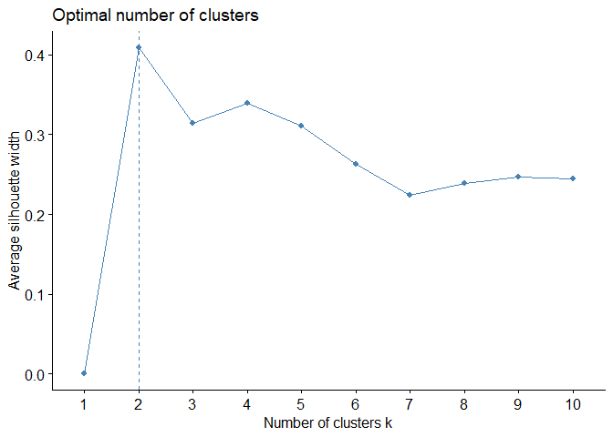
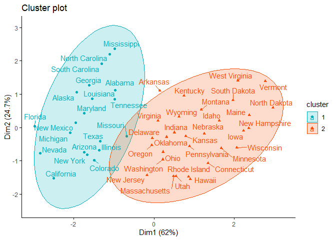

Partitioning Around Medoids(PAM)
================
Nidhin
25/07/2019

``` r
#Load the dataset
data=USArrests
```

``` r
#Check the dataset
str(data)
```

    ## 'data.frame':    50 obs. of  4 variables:
    ##  $ Murder  : num  13.2 10 8.1 8.8 9 7.9 3.3 5.9 15.4 17.4 ...
    ##  $ Assault : int  236 263 294 190 276 204 110 238 335 211 ...
    ##  $ UrbanPop: int  58 48 80 50 91 78 77 72 80 60 ...
    ##  $ Rape    : num  21.2 44.5 31 19.5 40.6 38.7 11.1 15.8 31.9 25.8 ...

``` r
head(data)
```

    ##            Murder Assault UrbanPop Rape
    ## Alabama      13.2     236       58 21.2
    ## Alaska       10.0     263       48 44.5
    ## Arizona       8.1     294       80 31.0
    ## Arkansas      8.8     190       50 19.5
    ## California    9.0     276       91 40.6
    ## Colorado      7.9     204       78 38.7

``` r
#Scale the data for standardization
df <- scale(USArrests) 
head(df)
```

    ##                Murder   Assault   UrbanPop         Rape
    ## Alabama    1.24256408 0.7828393 -0.5209066 -0.003416473
    ## Alaska     0.50786248 1.1068225 -1.2117642  2.484202941
    ## Arizona    0.07163341 1.4788032  0.9989801  1.042878388
    ## Arkansas   0.23234938 0.2308680 -1.0735927 -0.184916602
    ## California 0.27826823 1.2628144  1.7589234  2.067820292
    ## Colorado   0.02571456 0.3988593  0.8608085  1.864967207

``` r
#Load the required Libraries
library(cluster)
library(factoextra)
```

    ## Loading required package: ggplot2

    ## Welcome! Related Books: `Practical Guide To Cluster Analysis in R` at https://goo.gl/13EFCZ

``` r
#Estimating the optimal number of clusters
fviz_nbclust(df,pam,method="silhouette")
```

<!-- -->

``` r
#Computing PAM clustering

pam.model<- pam(df,2)
print(pam.model)
```

    ## Medoids:
    ##            ID     Murder    Assault   UrbanPop       Rape
    ## New Mexico 31  0.8292944  1.3708088  0.3081225  1.1603196
    ## Nebraska   27 -0.8008247 -0.8250772 -0.2445636 -0.5052109
    ## Clustering vector:
    ##        Alabama         Alaska        Arizona       Arkansas     California 
    ##              1              1              1              2              1 
    ##       Colorado    Connecticut       Delaware        Florida        Georgia 
    ##              1              2              2              1              1 
    ##         Hawaii          Idaho       Illinois        Indiana           Iowa 
    ##              2              2              1              2              2 
    ##         Kansas       Kentucky      Louisiana          Maine       Maryland 
    ##              2              2              1              2              1 
    ##  Massachusetts       Michigan      Minnesota    Mississippi       Missouri 
    ##              2              1              2              1              1 
    ##        Montana       Nebraska         Nevada  New Hampshire     New Jersey 
    ##              2              2              1              2              2 
    ##     New Mexico       New York North Carolina   North Dakota           Ohio 
    ##              1              1              1              2              2 
    ##       Oklahoma         Oregon   Pennsylvania   Rhode Island South Carolina 
    ##              2              2              2              2              1 
    ##   South Dakota      Tennessee          Texas           Utah        Vermont 
    ##              2              1              1              2              2 
    ##       Virginia     Washington  West Virginia      Wisconsin        Wyoming 
    ##              2              2              2              2              2 
    ## Objective function:
    ##    build     swap 
    ## 1.441358 1.368969 
    ## 
    ## Available components:
    ##  [1] "medoids"    "id.med"     "clustering" "objective"  "isolation" 
    ##  [6] "clusinfo"   "silinfo"    "diss"       "call"       "data"

    #Accessing to the results of the pam() function
    pam.model$medoids
    pam.model$clustering
    pam.model$data
    pam.model$clusinfo

``` r
#add the point classifications to the original data
dd <- cbind(USArrests, cluster = pam.model$cluster)
dd
```

    ##                Murder Assault UrbanPop Rape cluster
    ## Alabama          13.2     236       58 21.2       1
    ## Alaska           10.0     263       48 44.5       1
    ## Arizona           8.1     294       80 31.0       1
    ## Arkansas          8.8     190       50 19.5       2
    ## California        9.0     276       91 40.6       1
    ## Colorado          7.9     204       78 38.7       1
    ## Connecticut       3.3     110       77 11.1       2
    ## Delaware          5.9     238       72 15.8       2
    ## Florida          15.4     335       80 31.9       1
    ## Georgia          17.4     211       60 25.8       1
    ## Hawaii            5.3      46       83 20.2       2
    ## Idaho             2.6     120       54 14.2       2
    ## Illinois         10.4     249       83 24.0       1
    ## Indiana           7.2     113       65 21.0       2
    ## Iowa              2.2      56       57 11.3       2
    ## Kansas            6.0     115       66 18.0       2
    ## Kentucky          9.7     109       52 16.3       2
    ## Louisiana        15.4     249       66 22.2       1
    ## Maine             2.1      83       51  7.8       2
    ## Maryland         11.3     300       67 27.8       1
    ## Massachusetts     4.4     149       85 16.3       2
    ## Michigan         12.1     255       74 35.1       1
    ## Minnesota         2.7      72       66 14.9       2
    ## Mississippi      16.1     259       44 17.1       1
    ## Missouri          9.0     178       70 28.2       1
    ## Montana           6.0     109       53 16.4       2
    ## Nebraska          4.3     102       62 16.5       2
    ## Nevada           12.2     252       81 46.0       1
    ## New Hampshire     2.1      57       56  9.5       2
    ## New Jersey        7.4     159       89 18.8       2
    ## New Mexico       11.4     285       70 32.1       1
    ## New York         11.1     254       86 26.1       1
    ## North Carolina   13.0     337       45 16.1       1
    ## North Dakota      0.8      45       44  7.3       2
    ## Ohio              7.3     120       75 21.4       2
    ## Oklahoma          6.6     151       68 20.0       2
    ## Oregon            4.9     159       67 29.3       2
    ## Pennsylvania      6.3     106       72 14.9       2
    ## Rhode Island      3.4     174       87  8.3       2
    ## South Carolina   14.4     279       48 22.5       1
    ## South Dakota      3.8      86       45 12.8       2
    ## Tennessee        13.2     188       59 26.9       1
    ## Texas            12.7     201       80 25.5       1
    ## Utah              3.2     120       80 22.9       2
    ## Vermont           2.2      48       32 11.2       2
    ## Virginia          8.5     156       63 20.7       2
    ## Washington        4.0     145       73 26.2       2
    ## West Virginia     5.7      81       39  9.3       2
    ## Wisconsin         2.6      53       66 10.8       2
    ## Wyoming           6.8     161       60 15.6       2

``` r
#Visualizing PAM clusters
library(factoextra)
fviz_cluster(pam.model
,
palette = c("#00AFBB", "#FC4E07"), # color palette
ellipse.type = "t", # Concentration ellipse
repel = TRUE, # Avoid label overplotting (slow)
ggtheme = theme_classic()
)
```

<!-- -->
