PCA
================
Nidhin
09/08/2019

``` r
library(factoextra)
```

    ## Loading required package: ggplot2

    ## Welcome! Related Books: `Practical Guide To Cluster Analysis in R` at https://goo.gl/13EFCZ

``` r
library(corrplot)
```

    ## corrplot 0.84 loaded

\#the main purpose of principal component analysis is to: \#• identify
hidden pattern in a data set, \#• reduce the dimensionality of the data
by removing the noise and redundancy in the data, \#• identify
correlated
variables

``` r
wdbc<- read.csv("C:/Users/Nidhin/Desktop/Clustering/wdbc.csv", header = F)

head(wdbc)
```

    ##         V1 V2    V3    V4     V5     V6      V7      V8     V9     V10
    ## 1   842302  M 17.99 10.38 122.80 1001.0 0.11840 0.27760 0.3001 0.14710
    ## 2   842517  M 20.57 17.77 132.90 1326.0 0.08474 0.07864 0.0869 0.07017
    ## 3 84300903  M 19.69 21.25 130.00 1203.0 0.10960 0.15990 0.1974 0.12790
    ## 4 84348301  M 11.42 20.38  77.58  386.1 0.14250 0.28390 0.2414 0.10520
    ## 5 84358402  M 20.29 14.34 135.10 1297.0 0.10030 0.13280 0.1980 0.10430
    ## 6   843786  M 12.45 15.70  82.57  477.1 0.12780 0.17000 0.1578 0.08089
    ##      V11     V12    V13    V14   V15    V16      V17     V18     V19
    ## 1 0.2419 0.07871 1.0950 0.9053 8.589 153.40 0.006399 0.04904 0.05373
    ## 2 0.1812 0.05667 0.5435 0.7339 3.398  74.08 0.005225 0.01308 0.01860
    ## 3 0.2069 0.05999 0.7456 0.7869 4.585  94.03 0.006150 0.04006 0.03832
    ## 4 0.2597 0.09744 0.4956 1.1560 3.445  27.23 0.009110 0.07458 0.05661
    ## 5 0.1809 0.05883 0.7572 0.7813 5.438  94.44 0.011490 0.02461 0.05688
    ## 6 0.2087 0.07613 0.3345 0.8902 2.217  27.19 0.007510 0.03345 0.03672
    ##       V20     V21      V22   V23   V24    V25    V26    V27    V28    V29
    ## 1 0.01587 0.03003 0.006193 25.38 17.33 184.60 2019.0 0.1622 0.6656 0.7119
    ## 2 0.01340 0.01389 0.003532 24.99 23.41 158.80 1956.0 0.1238 0.1866 0.2416
    ## 3 0.02058 0.02250 0.004571 23.57 25.53 152.50 1709.0 0.1444 0.4245 0.4504
    ## 4 0.01867 0.05963 0.009208 14.91 26.50  98.87  567.7 0.2098 0.8663 0.6869
    ## 5 0.01885 0.01756 0.005115 22.54 16.67 152.20 1575.0 0.1374 0.2050 0.4000
    ## 6 0.01137 0.02165 0.005082 15.47 23.75 103.40  741.6 0.1791 0.5249 0.5355
    ##      V30    V31     V32
    ## 1 0.2654 0.4601 0.11890
    ## 2 0.1860 0.2750 0.08902
    ## 3 0.2430 0.3613 0.08758
    ## 4 0.2575 0.6638 0.17300
    ## 5 0.1625 0.2364 0.07678
    ## 6 0.1741 0.3985 0.12440

``` r
str(wdbc)
```

    ## 'data.frame':    569 obs. of  32 variables:
    ##  $ V1 : int  842302 842517 84300903 84348301 84358402 843786 844359 84458202 844981 84501001 ...
    ##  $ V2 : Factor w/ 2 levels "B","M": 2 2 2 2 2 2 2 2 2 2 ...
    ##  $ V3 : num  18 20.6 19.7 11.4 20.3 ...
    ##  $ V4 : num  10.4 17.8 21.2 20.4 14.3 ...
    ##  $ V5 : num  122.8 132.9 130 77.6 135.1 ...
    ##  $ V6 : num  1001 1326 1203 386 1297 ...
    ##  $ V7 : num  0.1184 0.0847 0.1096 0.1425 0.1003 ...
    ##  $ V8 : num  0.2776 0.0786 0.1599 0.2839 0.1328 ...
    ##  $ V9 : num  0.3001 0.0869 0.1974 0.2414 0.198 ...
    ##  $ V10: num  0.1471 0.0702 0.1279 0.1052 0.1043 ...
    ##  $ V11: num  0.242 0.181 0.207 0.26 0.181 ...
    ##  $ V12: num  0.0787 0.0567 0.06 0.0974 0.0588 ...
    ##  $ V13: num  1.095 0.543 0.746 0.496 0.757 ...
    ##  $ V14: num  0.905 0.734 0.787 1.156 0.781 ...
    ##  $ V15: num  8.59 3.4 4.58 3.44 5.44 ...
    ##  $ V16: num  153.4 74.1 94 27.2 94.4 ...
    ##  $ V17: num  0.0064 0.00522 0.00615 0.00911 0.01149 ...
    ##  $ V18: num  0.049 0.0131 0.0401 0.0746 0.0246 ...
    ##  $ V19: num  0.0537 0.0186 0.0383 0.0566 0.0569 ...
    ##  $ V20: num  0.0159 0.0134 0.0206 0.0187 0.0188 ...
    ##  $ V21: num  0.03 0.0139 0.0225 0.0596 0.0176 ...
    ##  $ V22: num  0.00619 0.00353 0.00457 0.00921 0.00511 ...
    ##  $ V23: num  25.4 25 23.6 14.9 22.5 ...
    ##  $ V24: num  17.3 23.4 25.5 26.5 16.7 ...
    ##  $ V25: num  184.6 158.8 152.5 98.9 152.2 ...
    ##  $ V26: num  2019 1956 1709 568 1575 ...
    ##  $ V27: num  0.162 0.124 0.144 0.21 0.137 ...
    ##  $ V28: num  0.666 0.187 0.424 0.866 0.205 ...
    ##  $ V29: num  0.712 0.242 0.45 0.687 0.4 ...
    ##  $ V30: num  0.265 0.186 0.243 0.258 0.163 ...
    ##  $ V31: num  0.46 0.275 0.361 0.664 0.236 ...
    ##  $ V32: num  0.1189 0.089 0.0876 0.173 0.0768 ...

``` r
features <- c("radius", "texture", "perimeter", "area", "smoothness", "compactness", "concavity", "concave_points", "symmetry", "fractal_dimension")

names(wdbc) <- c("id", "diagnosis", paste0(features,"_mean"), paste0(features,"_se"), paste0(features,"_worst"))
```

``` r
wdbc.pca <- prcomp(wdbc[c(3:32)], center = TRUE, scale = TRUE)
summary(wdbc.pca)
```

    ## Importance of components:
    ##                           PC1    PC2     PC3     PC4     PC5     PC6
    ## Standard deviation     3.6444 2.3857 1.67867 1.40735 1.28403 1.09880
    ## Proportion of Variance 0.4427 0.1897 0.09393 0.06602 0.05496 0.04025
    ## Cumulative Proportion  0.4427 0.6324 0.72636 0.79239 0.84734 0.88759
    ##                            PC7     PC8    PC9    PC10   PC11    PC12
    ## Standard deviation     0.82172 0.69037 0.6457 0.59219 0.5421 0.51104
    ## Proportion of Variance 0.02251 0.01589 0.0139 0.01169 0.0098 0.00871
    ## Cumulative Proportion  0.91010 0.92598 0.9399 0.95157 0.9614 0.97007
    ##                           PC13    PC14    PC15    PC16    PC17    PC18
    ## Standard deviation     0.49128 0.39624 0.30681 0.28260 0.24372 0.22939
    ## Proportion of Variance 0.00805 0.00523 0.00314 0.00266 0.00198 0.00175
    ## Cumulative Proportion  0.97812 0.98335 0.98649 0.98915 0.99113 0.99288
    ##                           PC19    PC20   PC21    PC22    PC23   PC24
    ## Standard deviation     0.22244 0.17652 0.1731 0.16565 0.15602 0.1344
    ## Proportion of Variance 0.00165 0.00104 0.0010 0.00091 0.00081 0.0006
    ## Cumulative Proportion  0.99453 0.99557 0.9966 0.99749 0.99830 0.9989
    ##                           PC25    PC26    PC27    PC28    PC29    PC30
    ## Standard deviation     0.12442 0.09043 0.08307 0.03987 0.02736 0.01153
    ## Proportion of Variance 0.00052 0.00027 0.00023 0.00005 0.00002 0.00000
    ## Cumulative Proportion  0.99942 0.99969 0.99992 0.99997 1.00000 1.00000

\#the eigenvalues measure the amount of variation retained by each
principal component. Eigenvalues are large for the first PCs and small
for the subsequent PCs. That is, the first PCs corresponds to the
directions with the maximum amount of variation in the data set.

``` r
eig.val <- get_eigenvalue(wdbc.pca)
print(eig.val)
```

    ##          eigenvalue variance.percent cumulative.variance.percent
    ## Dim.1  1.328161e+01     4.427203e+01                    44.27203
    ## Dim.2  5.691355e+00     1.897118e+01                    63.24321
    ## Dim.3  2.817949e+00     9.393163e+00                    72.63637
    ## Dim.4  1.980640e+00     6.602135e+00                    79.23851
    ## Dim.5  1.648731e+00     5.495768e+00                    84.73427
    ## Dim.6  1.207357e+00     4.024522e+00                    88.75880
    ## Dim.7  6.752201e-01     2.250734e+00                    91.00953
    ## Dim.8  4.766171e-01     1.588724e+00                    92.59825
    ## Dim.9  4.168948e-01     1.389649e+00                    93.98790
    ## Dim.10 3.506935e-01     1.168978e+00                    95.15688
    ## Dim.11 2.939157e-01     9.797190e-01                    96.13660
    ## Dim.12 2.611614e-01     8.705379e-01                    97.00714
    ## Dim.13 2.413575e-01     8.045250e-01                    97.81166
    ## Dim.14 1.570097e-01     5.233657e-01                    98.33503
    ## Dim.15 9.413497e-02     3.137832e-01                    98.64881
    ## Dim.16 7.986280e-02     2.662093e-01                    98.91502
    ## Dim.17 5.939904e-02     1.979968e-01                    99.11302
    ## Dim.18 5.261878e-02     1.753959e-01                    99.28841
    ## Dim.19 4.947759e-02     1.649253e-01                    99.45334
    ## Dim.20 3.115940e-02     1.038647e-01                    99.55720
    ## Dim.21 2.997289e-02     9.990965e-02                    99.65711
    ## Dim.22 2.743940e-02     9.146468e-02                    99.74858
    ## Dim.23 2.434084e-02     8.113613e-02                    99.82971
    ## Dim.24 1.805501e-02     6.018336e-02                    99.88990
    ## Dim.25 1.548127e-02     5.160424e-02                    99.94150
    ## Dim.26 8.177640e-03     2.725880e-02                    99.96876
    ## Dim.27 6.900464e-03     2.300155e-02                    99.99176
    ## Dim.28 1.589338e-03     5.297793e-03                    99.99706
    ## Dim.29 7.488031e-04     2.496010e-03                    99.99956
    ## Dim.30 1.330448e-04     4.434827e-04                   100.00000

``` r
fviz_eig(wdbc.pca,addlabels = TRUE, ylim=c(0,50))
```

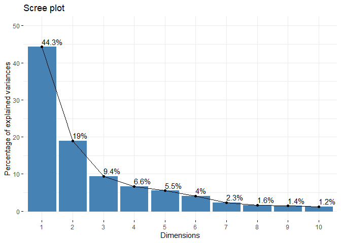<!-- -->

\#Graph of variables \#A simple method to extract the results, for
variables, from a PCA output is to use the function

``` r
var.pca <- get_pca_var(wdbc.pca)


head(var.pca$coord,3)
```

    ##                     Dim.1     Dim.2       Dim.3       Dim.4       Dim.5
    ## radius_mean    -0.7977668 0.5579027 -0.01432118  0.05827700 -0.04851878
    ## texture_mean   -0.3780132 0.1424382  0.10835829 -0.84870380  0.06351944
    ## perimeter_mean -0.8292355 0.5133487 -0.01563555  0.05908501 -0.04799015
    ##                      Dim.6        Dim.7        Dim.8       Dim.9
    ## radius_mean     0.02059234 -0.101965596  0.005144876 -0.14405616
    ## texture_mean   -0.03535803  0.009367203 -0.090214585  0.07276706
    ## perimeter_mean  0.01901848 -0.094067834  0.012901209 -0.14446258
    ##                    Dim.10       Dim.11     Dim.12      Dim.13       Dim.14
    ## radius_mean    0.05654648 -0.022483349 0.02609749 0.005879269  0.023578980
    ## texture_mean   0.14267965  0.163858215 0.13026214 0.099956785 -0.008543071
    ## perimeter_mean 0.05115702 -0.009098538 0.01989278 0.021670182  0.019223333
    ##                     Dim.15      Dim.16       Dim.17       Dim.18
    ## radius_mean    -0.01568397 -0.04255502  0.049456533  0.033654027
    ## texture_mean   -0.03311213 -0.04460615 -0.009433423 -0.009428525
    ## perimeter_mean -0.01224279 -0.03234470  0.047481690  0.036316100
    ##                     Dim.19       Dim.20      Dim.21      Dim.22
    ## radius_mean    0.050133570 -0.008772821 -0.01187131 -0.01208056
    ## texture_mean   0.006626055 -0.043094773  0.07762478 -0.01570358
    ## perimeter_mean 0.053294517 -0.003118233 -0.01207889 -0.01245022
    ##                       Dim.23      Dim.24       Dim.25       Dim.26
    ## radius_mean    -1.537575e-02 -0.02453300 -0.002392233 -0.011708590
    ## texture_mean   -8.658821e-05  0.01327387  0.010544407 -0.002220667
    ## perimeter_mean -6.278798e-03 -0.01567398  0.003361359 -0.011326933
    ##                      Dim.27        Dim.28        Dim.29        Dim.30
    ## radius_mean    -0.010925793  8.419566e-03  0.0057864603  8.101999e-03
    ## texture_mean   -0.001441855 -2.623673e-06 -0.0002882534  3.156545e-06
    ## perimeter_mean -0.009587447  3.362272e-03  0.0105031198 -7.957621e-03

``` r
head(var.pca$cor,3)
```

    ##                     Dim.1     Dim.2       Dim.3       Dim.4       Dim.5
    ## radius_mean    -0.7977668 0.5579027 -0.01432118  0.05827700 -0.04851878
    ## texture_mean   -0.3780132 0.1424382  0.10835829 -0.84870380  0.06351944
    ## perimeter_mean -0.8292355 0.5133487 -0.01563555  0.05908501 -0.04799015
    ##                      Dim.6        Dim.7        Dim.8       Dim.9
    ## radius_mean     0.02059234 -0.101965596  0.005144876 -0.14405616
    ## texture_mean   -0.03535803  0.009367203 -0.090214585  0.07276706
    ## perimeter_mean  0.01901848 -0.094067834  0.012901209 -0.14446258
    ##                    Dim.10       Dim.11     Dim.12      Dim.13       Dim.14
    ## radius_mean    0.05654648 -0.022483349 0.02609749 0.005879269  0.023578980
    ## texture_mean   0.14267965  0.163858215 0.13026214 0.099956785 -0.008543071
    ## perimeter_mean 0.05115702 -0.009098538 0.01989278 0.021670182  0.019223333
    ##                     Dim.15      Dim.16       Dim.17       Dim.18
    ## radius_mean    -0.01568397 -0.04255502  0.049456533  0.033654027
    ## texture_mean   -0.03311213 -0.04460615 -0.009433423 -0.009428525
    ## perimeter_mean -0.01224279 -0.03234470  0.047481690  0.036316100
    ##                     Dim.19       Dim.20      Dim.21      Dim.22
    ## radius_mean    0.050133570 -0.008772821 -0.01187131 -0.01208056
    ## texture_mean   0.006626055 -0.043094773  0.07762478 -0.01570358
    ## perimeter_mean 0.053294517 -0.003118233 -0.01207889 -0.01245022
    ##                       Dim.23      Dim.24       Dim.25       Dim.26
    ## radius_mean    -1.537575e-02 -0.02453300 -0.002392233 -0.011708590
    ## texture_mean   -8.658821e-05  0.01327387  0.010544407 -0.002220667
    ## perimeter_mean -6.278798e-03 -0.01567398  0.003361359 -0.011326933
    ##                      Dim.27        Dim.28        Dim.29        Dim.30
    ## radius_mean    -0.010925793  8.419566e-03  0.0057864603  8.101999e-03
    ## texture_mean   -0.001441855 -2.623673e-06 -0.0002882534  3.156545e-06
    ## perimeter_mean -0.009587447  3.362272e-03  0.0105031198 -7.957621e-03

``` r
head(var.pca$cos2,3)
```

    ##                    Dim.1      Dim.2        Dim.3       Dim.4       Dim.5
    ## radius_mean    0.6364318 0.31125539 0.0002050963 0.003396209 0.002354072
    ## texture_mean   0.1428940 0.02028864 0.0117415199 0.720298141 0.004034719
    ## perimeter_mean 0.6876316 0.26352690 0.0002444703 0.003491038 0.002303055
    ##                       Dim.6        Dim.7        Dim.8       Dim.9
    ## radius_mean    0.0004240444 0.0103969827 2.646975e-05 0.020752176
    ## texture_mean   0.0012501906 0.0000877445 8.138671e-03 0.005295045
    ## perimeter_mean 0.0003617026 0.0088487573 1.664412e-04 0.020869436
    ##                     Dim.10       Dim.11       Dim.12       Dim.13
    ## radius_mean    0.003197504 5.055010e-04 0.0006810789 3.456581e-05
    ## texture_mean   0.020357483 2.684951e-02 0.0169682252 9.991359e-03
    ## perimeter_mean 0.002617041 8.278339e-05 0.0003957226 4.695968e-04
    ##                      Dim.14       Dim.15      Dim.16       Dim.17
    ## radius_mean    5.559683e-04 0.0002459868 0.001810929 2.445949e-03
    ## texture_mean   7.298407e-05 0.0010964134 0.001989709 8.898948e-05
    ## perimeter_mean 3.695365e-04 0.0001498859 0.001046179 2.254511e-03
    ##                      Dim.18       Dim.19       Dim.20       Dim.21
    ## radius_mean    1.132594e-03 0.0025133748 7.696239e-05 0.0001409279
    ## texture_mean   8.889709e-05 0.0000439046 1.857159e-03 0.0060256061
    ## perimeter_mean 1.318859e-03 0.0028403055 9.723374e-06 0.0001458996
    ##                      Dim.22       Dim.23       Dim.24       Dim.25
    ## radius_mean    0.0001459399 2.364136e-04 0.0006018682 5.722780e-06
    ## texture_mean   0.0002466023 7.497518e-09 0.0001761957 1.111845e-04
    ## perimeter_mean 0.0001550079 3.942330e-05 0.0002456738 1.129874e-05
    ##                      Dim.26       Dim.27       Dim.28       Dim.29
    ## radius_mean    1.370911e-04 1.193730e-04 7.088910e-05 3.348312e-05
    ## texture_mean   4.931360e-06 2.078945e-06 6.883658e-12 8.309002e-08
    ## perimeter_mean 1.282994e-04 9.191915e-05 1.130487e-05 1.103155e-04
    ##                      Dim.30
    ## radius_mean    6.564239e-05
    ## texture_mean   9.963774e-12
    ## perimeter_mean 6.332372e-05

``` r
head(var.pca$contrib,3)
```

    ##                   Dim.1     Dim.2       Dim.3      Dim.4     Dim.5
    ## radius_mean    4.791828 5.4689158 0.007278210  0.1714702 0.1427809
    ## texture_mean   1.075879 0.3564817 0.416669002 36.3669303 0.2447167
    ## perimeter_mean 5.177322 4.6303018 0.008675469  0.1762581 0.1396865
    ##                     Dim.6      Dim.7       Dim.8    Dim.9    Dim.10
    ## radius_mean    0.03512172 1.53979162 0.005553672 4.977797 0.9117661
    ## texture_mean   0.10354775 0.01299495 1.707590993 1.270115 5.8049224
    ## perimeter_mean 0.02995823 1.31049967 0.034921362 5.005924 0.7462474
    ##                    Dim.11    Dim.12     Dim.13     Dim.14    Dim.15
    ## radius_mean    0.17198842 0.2607885 0.01432142 0.35409801 0.2613129
    ## texture_mean   9.13510741 6.4972186 4.13965139 0.04648379 1.1647249
    ## perimeter_mean 0.02816569 0.1515242 0.19456483 0.23535900 0.1592244
    ##                  Dim.16    Dim.17    Dim.18     Dim.19     Dim.20
    ## radius_mean    2.267551 4.1178253 2.1524510 5.07982446 0.24699572
    ## texture_mean   2.491408 0.1498164 0.1689455 0.08873633 5.96018948
    ## perimeter_mean 1.309971 3.7955343 2.5064416 5.74058961 0.03120527
    ##                    Dim.21    Dim.22       Dim.23   Dim.24     Dim.25
    ## radius_mean     0.4701846 0.5318625 9.712634e-01 3.333525 0.03696583
    ## texture_mean   20.1035179 0.8987160 3.080222e-05 0.975883 0.71818728
    ## perimeter_mean  0.4867719 0.5649097 1.619636e-01 1.360696 0.07298326
    ##                    Dim.26     Dim.27       Dim.28      Dim.29       Dim.30
    ## radius_mean    1.67641371 1.72992648 4.460291e+00  4.47155242 4.933856e+01
    ## texture_mean   0.06030297 0.03012762 4.331148e-07  0.01109638 7.489035e-06
    ## perimeter_mean 1.56890519 1.33207198 7.112943e-01 14.73224737 4.759578e+01

# Quality of representation

\#The quality of representation of the variables on factor map is called
cos2 (square cosine, squared coordinates) . \#The squared cosine shows
the importance of a component for a given observation. The squared
cosine indicates the contribution of a component to the squared distance
of the observation to the
    origin.

``` r
head(var.pca$cos2, 4)
```

    ##                    Dim.1      Dim.2        Dim.3       Dim.4        Dim.5
    ## radius_mean    0.6364318 0.31125539 0.0002050963 0.003396209 0.0023540715
    ## texture_mean   0.1428940 0.02028864 0.0117415199 0.720298141 0.0040347193
    ## perimeter_mean 0.6876316 0.26352690 0.0002444703 0.003491038 0.0023030547
    ## area_mean      0.6486576 0.30389811 0.0023210397 0.005655066 0.0001759769
    ##                       Dim.6        Dim.7        Dim.8       Dim.9
    ## radius_mean    4.240444e-04 0.0103969827 2.646975e-05 0.020752176
    ## texture_mean   1.250191e-03 0.0000877445 8.138671e-03 0.005295045
    ## perimeter_mean 3.617026e-04 0.0088487573 1.664412e-04 0.020869436
    ## area_mean      4.302527e-06 0.0018015390 5.730172e-04 0.015947848
    ##                     Dim.10       Dim.11       Dim.12       Dim.13
    ## radius_mean    0.003197504 5.055010e-04 0.0006810789 3.456581e-05
    ## texture_mean   0.020357483 2.684951e-02 0.0169682252 9.991359e-03
    ## perimeter_mean 0.002617041 8.278339e-05 0.0003957226 4.695968e-04
    ## area_mean      0.001970362 3.567358e-03 0.0011183106 1.095640e-03
    ##                      Dim.14       Dim.15      Dim.16       Dim.17
    ## radius_mean    5.559683e-04 2.459868e-04 0.001810929 2.445949e-03
    ## texture_mean   7.298407e-05 1.096413e-03 0.001989709 8.898948e-05
    ## perimeter_mean 3.695365e-04 1.498859e-04 0.001046179 2.254511e-03
    ## area_mean      1.841832e-05 1.836333e-05 0.001400992 3.883832e-03
    ##                      Dim.18       Dim.19       Dim.20       Dim.21
    ## radius_mean    1.132594e-03 2.513375e-03 7.696239e-05 1.409279e-04
    ## texture_mean   8.889709e-05 4.390460e-05 1.857159e-03 6.025606e-03
    ## perimeter_mean 1.318859e-03 2.840305e-03 9.723374e-06 1.458996e-04
    ## area_mean      3.727802e-03 3.693512e-05 2.531981e-04 1.019542e-05
    ##                      Dim.22       Dim.23       Dim.24       Dim.25
    ## radius_mean    0.0001459399 2.364136e-04 6.018682e-04 5.722780e-06
    ## texture_mean   0.0002466023 7.497518e-09 1.761957e-04 1.111845e-04
    ## perimeter_mean 0.0001550079 3.942330e-05 2.456738e-04 1.129874e-05
    ## area_mean      0.0002611979 1.472279e-06 8.808659e-05 6.829892e-04
    ##                      Dim.26       Dim.27       Dim.28       Dim.29
    ## radius_mean    1.370911e-04 1.193730e-04 7.088910e-05 3.348312e-05
    ## texture_mean   4.931360e-06 2.078945e-06 6.883658e-12 8.309002e-08
    ## perimeter_mean 1.282994e-04 9.191915e-05 1.130487e-05 1.103155e-04
    ## area_mean      1.075942e-03 1.502419e-03 1.180255e-04 1.338527e-04
    ##                      Dim.30
    ## radius_mean    6.564239e-05
    ## texture_mean   9.963774e-12
    ## perimeter_mean 6.332372e-05
    ## area_mean      1.444238e-07

``` r
corrplot(var.pca$cos2, is.corr=FALSE)
```

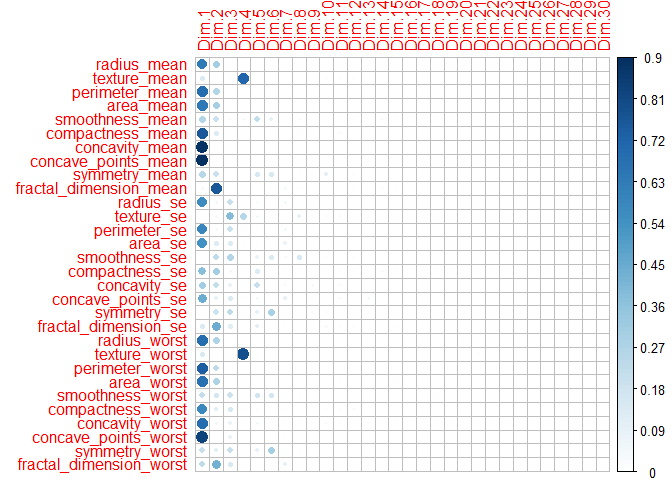<!-- -->

``` r
# Total cos2 of variables on Dim.1 and Dim.2
fviz_cos2(wdbc.pca, choice = "var", axes = 1:2)
```

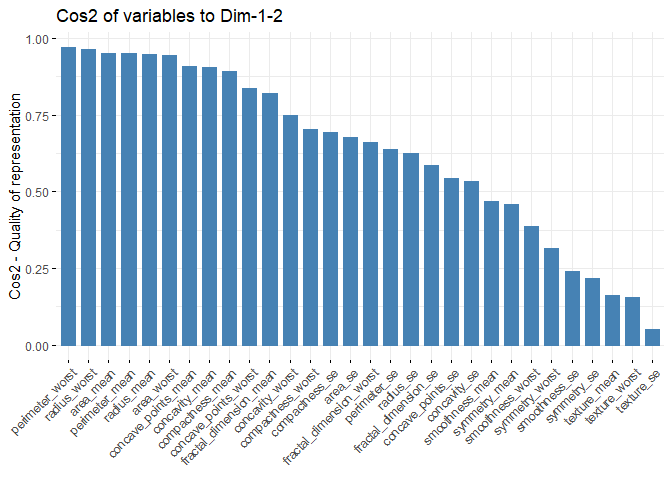<!-- -->
\#Contributions of variables to PCs \#The contributions of variables in
accounting for the variability in a given principal component are
expressed in percentage. \#Variables that are correlated with PC1 (i.e.,
Dim.1) and PC2 (i.e., Dim.2) are the most important in explaining the
variability in the data set. \#Variables that do not correlated with any
PC or correlated with the last dimensions are variables with low
contribution and might be removed to simplify the overall analysis.
\#The contribution of variables can be extracted as follow
    :

``` r
head(var.pca$contrib, 4)
```

    ##                   Dim.1     Dim.2       Dim.3      Dim.4      Dim.5
    ## radius_mean    4.791828 5.4689158 0.007278210  0.1714702 0.14278085
    ## texture_mean   1.075879 0.3564817 0.416669002 36.3669303 0.24471672
    ## perimeter_mean 5.177322 4.6303018 0.008675469  0.1762581 0.13968654
    ## area_mean      4.883878 5.3396446 0.082366279  0.2855170 0.01067348
    ##                       Dim.6      Dim.7       Dim.8    Dim.9    Dim.10
    ## radius_mean    0.0351217226 1.53979162 0.005553672 4.977797 0.9117661
    ## texture_mean   0.1035477523 0.01299495 1.707590993 1.270115 5.8049224
    ## perimeter_mean 0.0299582265 1.31049967 0.034921362 5.005924 0.7462474
    ## area_mean      0.0003563592 0.26680766 0.120225880 3.825389 0.5618475
    ##                    Dim.11    Dim.12     Dim.13     Dim.14     Dim.15
    ## radius_mean    0.17198842 0.2607885 0.01432142 0.35409801 0.26131291
    ## texture_mean   9.13510741 6.4972186 4.13965139 0.04648379 1.16472490
    ## perimeter_mean 0.02816569 0.1515242 0.19456483 0.23535900 0.15922443
    ## area_mean      1.21373501 0.4282067 0.45394900 0.01173069 0.01950745
    ##                  Dim.16    Dim.17    Dim.18     Dim.19     Dim.20
    ## radius_mean    2.267551 4.1178253 2.1524510 5.07982446 0.24699572
    ## texture_mean   2.491408 0.1498164 0.1689455 0.08873633 5.96018948
    ## perimeter_mean 1.309971 3.7955343 2.5064416 5.74058961 0.03120527
    ## area_mean      1.754248 6.5385437 7.0845460 0.07465020 0.81258978
    ##                     Dim.21    Dim.22       Dim.23   Dim.24     Dim.25
    ## radius_mean     0.47018457 0.5318625 9.712634e-01 3.333525 0.03696583
    ## texture_mean   20.10351786 0.8987160 3.080222e-05 0.975883 0.71818728
    ## perimeter_mean  0.48677194 0.5649097 1.619636e-01 1.360696 0.07298326
    ## area_mean       0.03401545 0.9519081 6.048598e-03 0.487879 4.41171292
    ##                     Dim.26      Dim.27       Dim.28      Dim.29
    ## radius_mean     1.67641371  1.72992648 4.460291e+00  4.47155242
    ## texture_mean    0.06030297  0.03012762 4.331148e-07  0.01109638
    ## perimeter_mean  1.56890519  1.33207198 7.112943e-01 14.73224737
    ## area_mean      13.15711689 21.77272040 7.426079e+00 17.87555442
    ##                      Dim.30
    ## radius_mean    4.933856e+01
    ## texture_mean   7.489035e-06
    ## perimeter_mean 4.759578e+01
    ## area_mean      1.085528e-01

``` r
library("corrplot")
corrplot(var.pca$contrib, is.corr=FALSE )
```

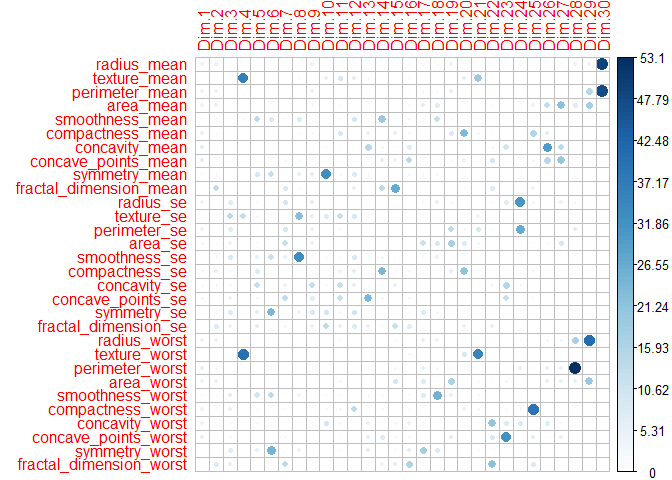<!-- -->

``` r
# Contributions of variables to PC1
fviz_contrib(wdbc.pca, choice = "var", axes = 1, top = 10)
```

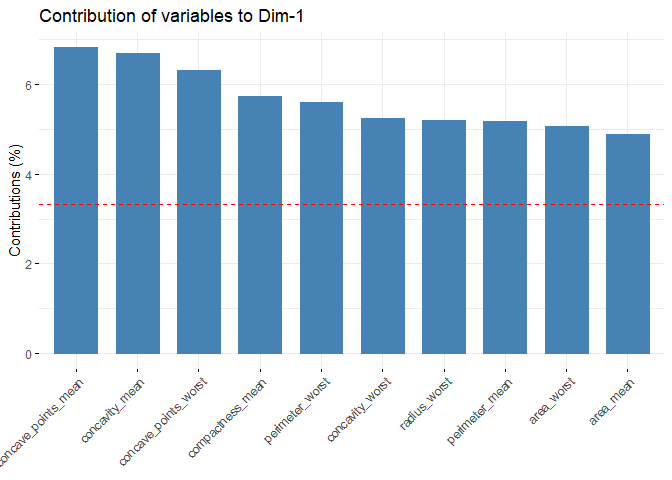<!-- -->

``` r
# Contributions of variables to PC2
fviz_contrib(wdbc.pca, choice = "var", axes = 2, top = 10)
```

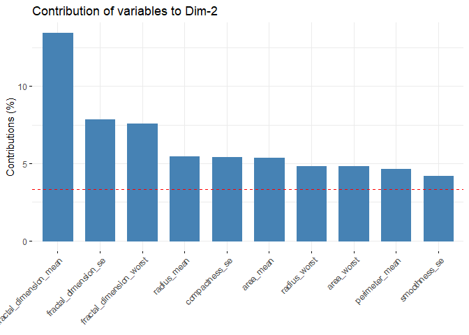<!-- -->

``` r
#The total contribution to PC1 and PC2 is obtained with the following R code:
fviz_contrib(wdbc.pca, choice = "var", axes = 1:2, top = 10)
```

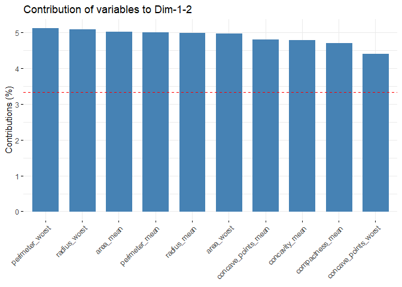<!-- -->

``` r
fviz_pca_var(wdbc.pca, col.var = "contrib",
             gradient.cols = c("#00AFBB", "#E7B800", "#FC4E07"))
```

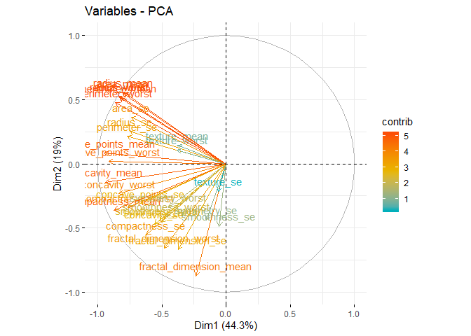<!-- -->

``` r
#Create a grouping variable using kmeans
# Create 3 groups of variables (centers = 3)
set.seed(123)
res.km <- kmeans(var.pca$coord, centers = 2, nstart = 25)
grp <- as.factor(res.km$cluster)
# Color variables by groups
fviz_pca_var(wdbc.pca, col.var = grp, 
             palette = c("#0073C2FF", "#EFC000FF", "#868686FF"),
             legend.title = "Cluster")
```

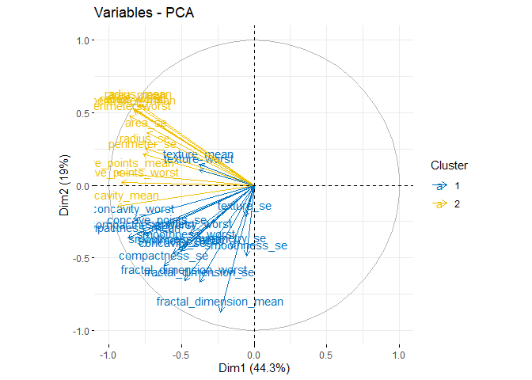<!-- -->

# Let’s actually add the response variable (diagnosis) to the plot and see if we can make better sense of it:

\#With just the first two components we can clearly see some separation
between the benign and malignant tumors. This is a clear indication that
the data is well-suited for some kind of classification model (like
discriminant analysis).

\#CONCLUSION \# the first 6 components has an Eigenvalue \>1 and
explains almost 90% of variance, this is great\! We can effectively
reduce dimensionality from 30 to 6 while only “loosing” about 10% of
variance\! \#We also notice that we can actually explain more than 60%
of variance with just the first two
components.

``` r
plot(wdbc.pca$x[,1],wdbc.pca$x[,2], xlab="PC1 (44.3%)", ylab = "PC2 (19%)", main = "PC1 / PC2 - plot")
```

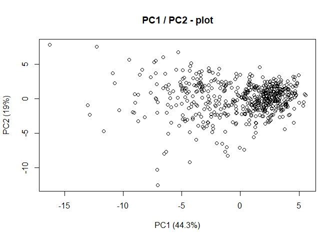<!-- -->

``` r
fviz_pca_ind(wdbc.pca, geom.ind = "point", pointshape = 21, 
             pointsize = 2, 
             fill.ind = wdbc$diagnosis, 
             col.ind = "black", 
             palette = "jco", 
             addEllipses = TRUE,
             label = "var",
             col.var = "black",
             repel = TRUE,
             legend.title = "Diagnosis") +
  ggtitle("2D PCA-plot from 30 feature dataset") +
  theme(plot.title = element_text(hjust = 0.5))
```

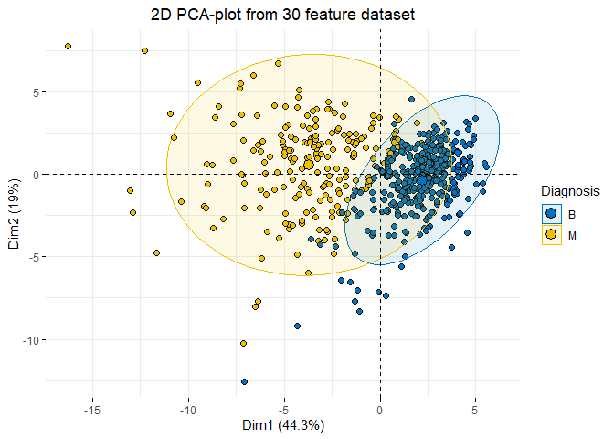<!-- -->
